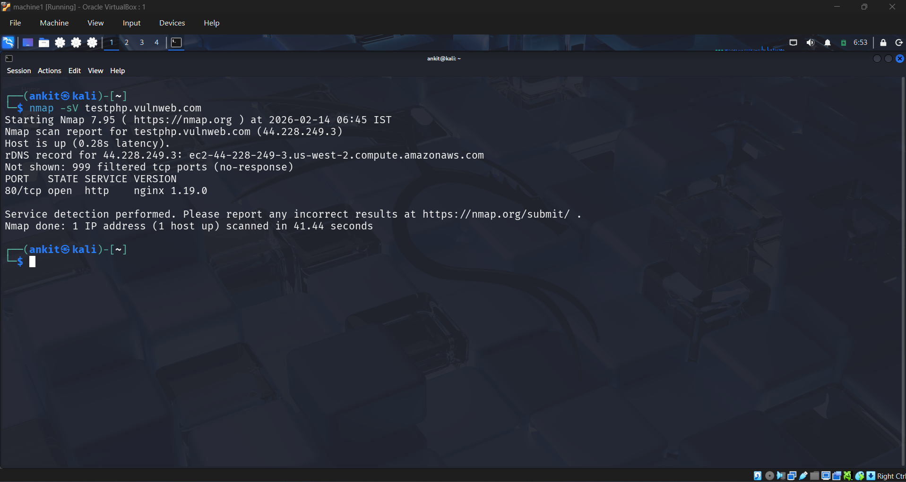
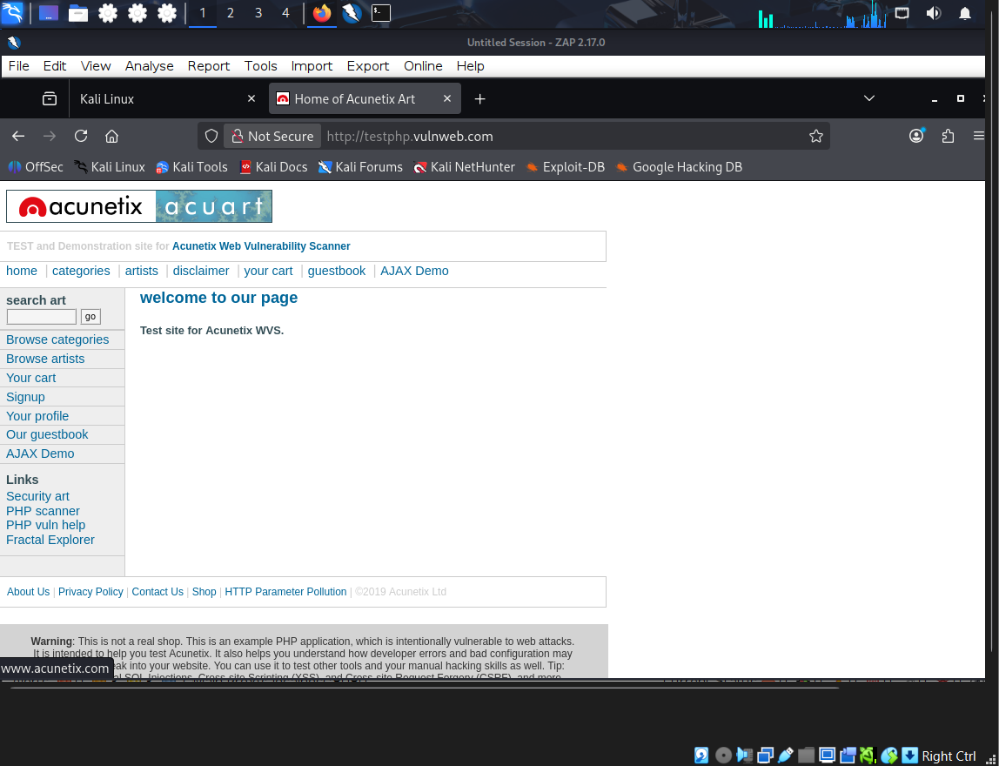
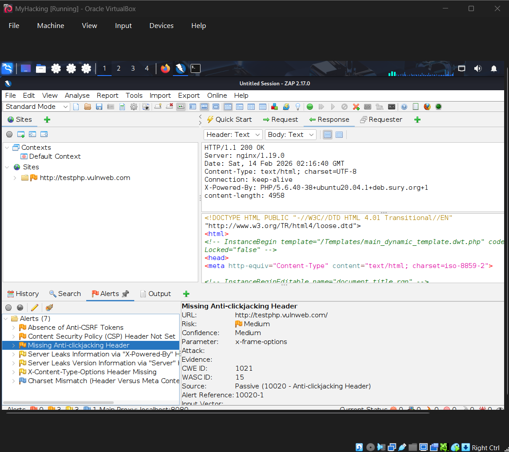
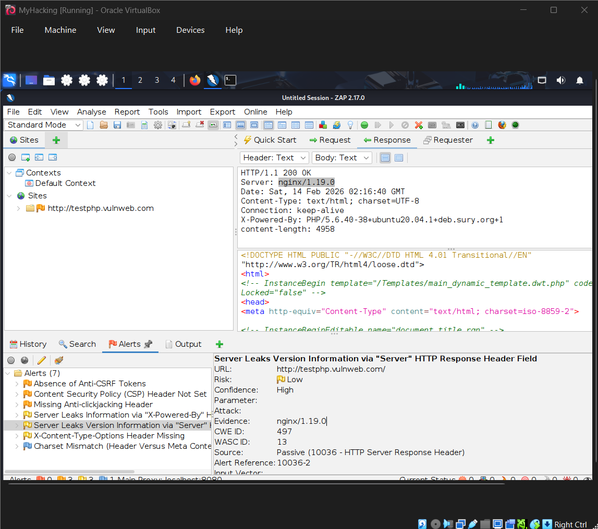

# Task 1 – Vulnerability Assessment

## Target
http://testphp.vulnweb.com

## Objective
To perform a vulnerability assessment on a live web application using passive and reconnaissance techniques.

## Tools Used
- Nmap (Service Enumeration)
- OWASP ZAP (Passive Scan)
- Kali Linux (Testing Environment)

## Methodology
1. Service detection using Nmap
2. Manual browsing of the application
3. Passive scanning using OWASP ZAP
4. HTTP header analysis

## Deliverables
- Vulnerability Assessment Report (PDF)
- Supporting screenshots

---

## 📸 Evidence Screenshots

### 1️⃣ Nmap Service Detection

---

### 2️⃣ Target Web Application

---

### 3️⃣ Content Security Policy Not Set

---

### 4️⃣ Missing Anti-Clickjacking Header

---

### 5️⃣ Server Version Disclosure

---

### 6️⃣ X-Content-Type-Options Header Missing

